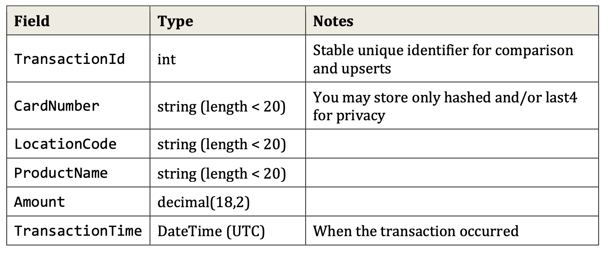

# development practice
## instalation and setup

### run the following commands to install and add the necessary packages:

for EFC: `dotnet add package Microsoft.EntityFrameworkCore`

for design: `dotnet add package Microsoft.EntityFrameworkCore.Design`

for SQLite: `dotnet add package Microsoft.EntityFrameworkCore.Sqlite`

### to build and run

`dotnet build && dotnet run`

## methodology

For this particular project, I was mocking the response of an API, rather than actually calling it. This is why I hava a hard coded json string in the beginning. That would be replaced with an api call if used with actual data.

After receiving the json string, I needed to format it into a list that I could itterate over.

For each iteration, I checked to see if the transaction id was present in the SQLite database. If it was found (and didn't have a finalized status) I overrode the data because I wanted the most up to date changes. If the transaction id wasn't found, I simply created a new entry in the database with status `active`.

After creating or updating the data, I updated the database reference so that I was starting with the newly updated data for the next step.

To make the datetime calculation, I recorded the time present in the datebase, and the current time, checked the difference, and used an if condition to see whether I should update status to `revoked` or `finalized`.

## assumptions
The format of api response is exactly as follows:

